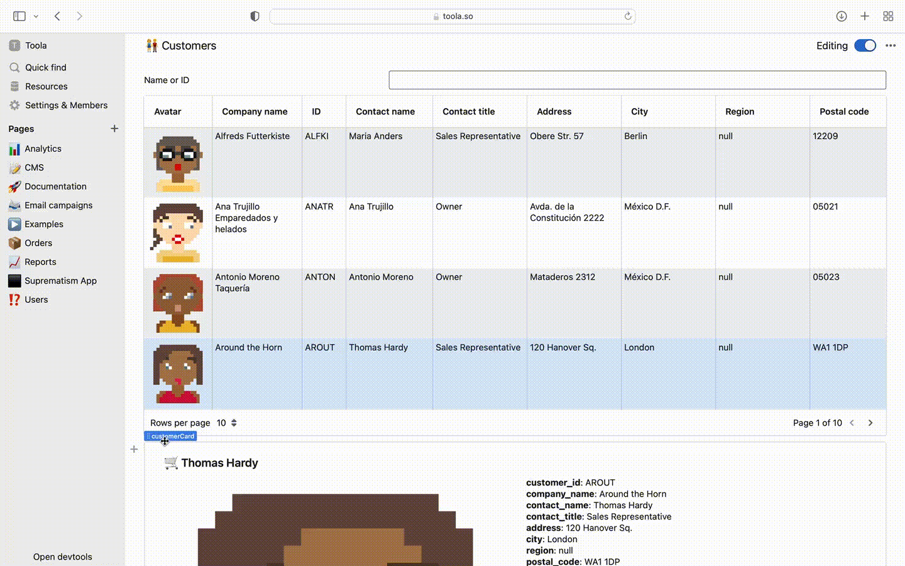
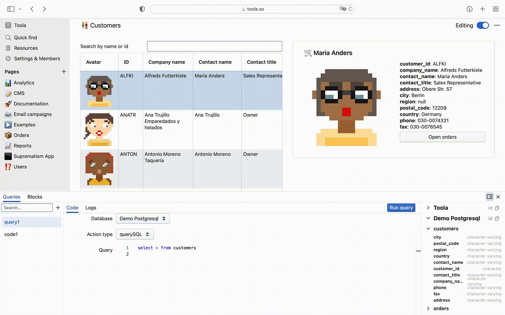
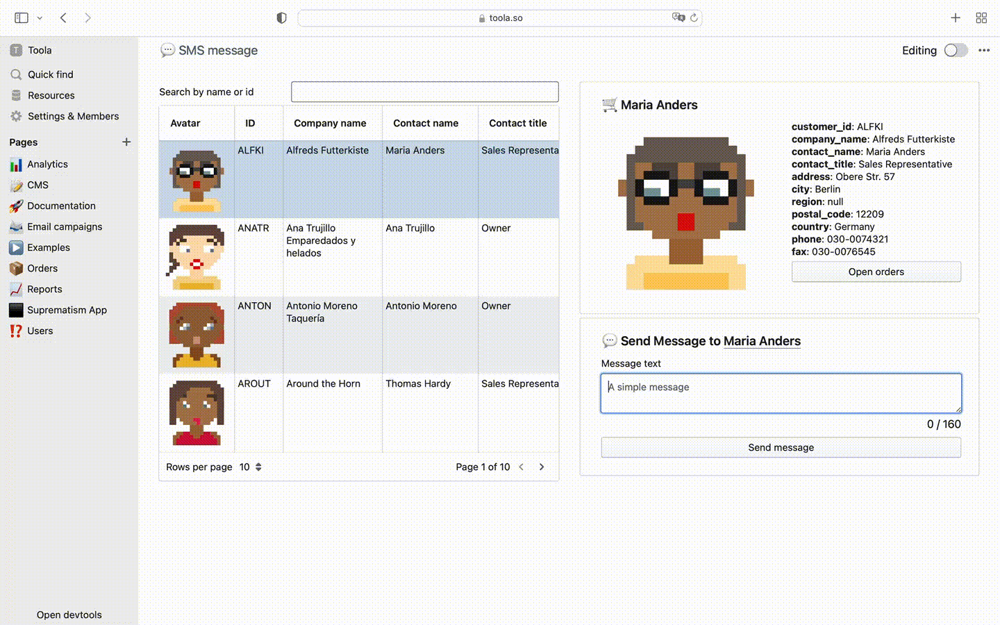

# 🍪 Toola
The open-source Retool alternative. Low-code platform for building internal tools fast!

## 🪄 Simple as Notion
It looks like Notion, but cells can run JavaScript or present as one of 30+ powerful blocks. Drag and drop your next level dashboard in 30 seconds. Focus on what makes your customers love, we will take the rest

## 👩‍💻 Built for developers
Use GUI and javascript with brackets like ${input.value} to make simple queries; or brake browser limits with NodeJS functions + all npm packages preinstalled: file system, image processing, heavy calculations, large payloads, thousands http or database requests and so on...
### SQL query

### NodeJS query

## 🤝 Workspace for every team
Build sharable and reusable tools that everyone can use. Use enterprise-ready access control to keep your data safe.
